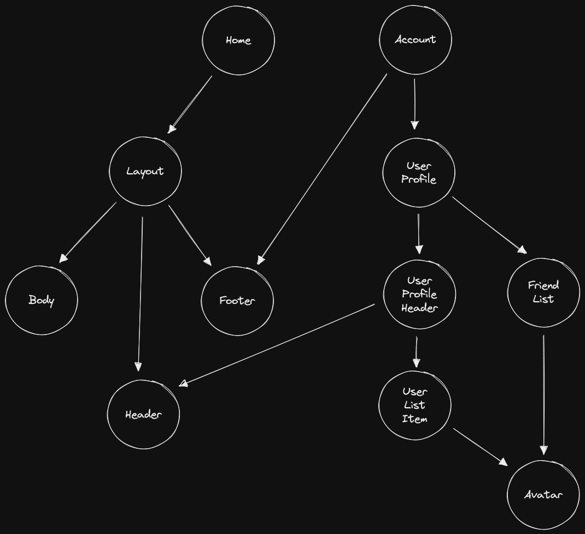
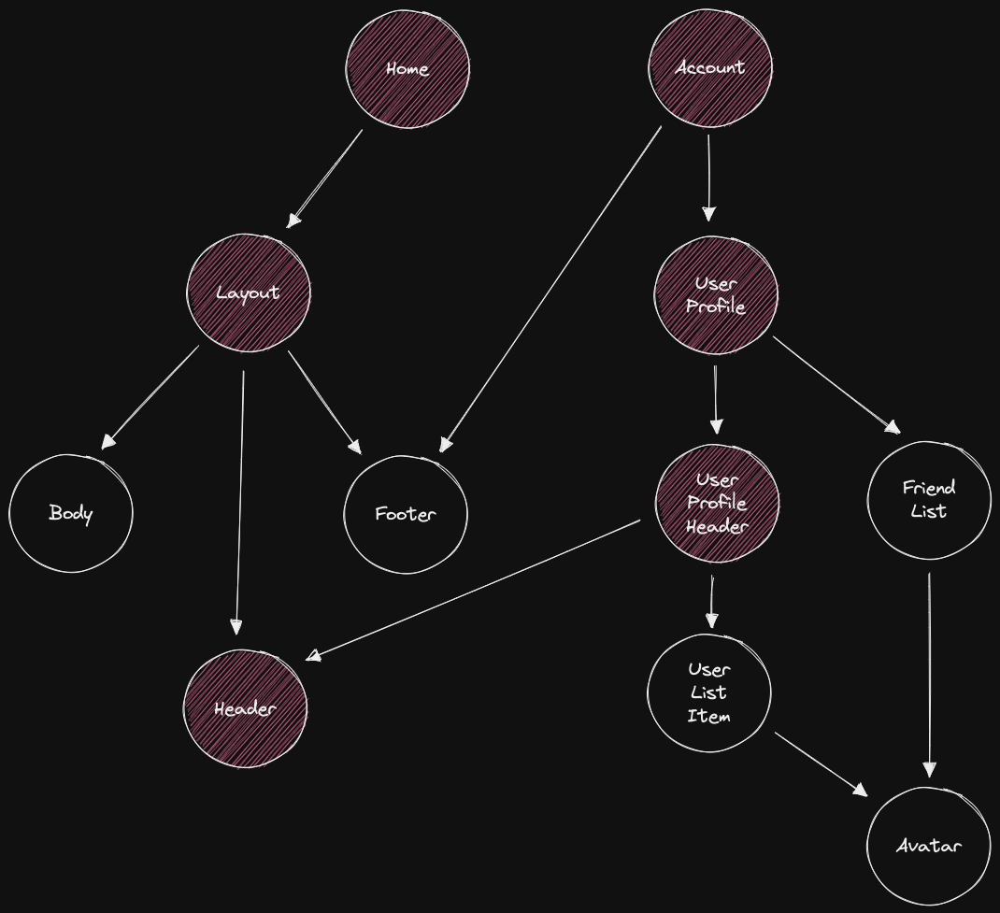

# VCU - Visualize Component Usage

Visualize React component relationships and communication channels. 
This developer tool operates on the command line and aims to give in-depth insight into a React project to support refactoring.

## Demo

This is a react component tree for some application.



We can highlight the components that depend on the `Header` component like this.



## Internal data structure

### Simple

input:

```tsx
// file: /components/Layout.tsx
export const Header = () => <div>Header</div>
export const Body = () => <div>Body</div> 
export const Footer = () => <div>Footer</div>

export const Layout = () => (
    <>
        <Header />
        <Body />
        <Footer />
    </>
)
```

output:

```json
{
    "<project_root>/components/Layout.tsx": {
        "Header": [{
            "file_path": "<project_root>/components/Layout.tsx",
            "component_name": "Layout"
        }],
        "Body": [{
            "file_path": "<project_root>/components/Layout.tsx",
            "component_name": "Layout"
        }],
        "Footer": [{
            "file_path": "<project_root>/components/Layout.tsx",
            "component_name": "Layout"
        }],
        "Layout": []
    }
}
```

### Default export

input:

```tsx
// file: /components/Layout.tsx
export const Layout = () => <div>Layout</div>
export default Layout
```

output:

```json
{
    "<project_root>/components/Layout.tsx": {
        "Layout": [{
            "file_path": "<project_root>/components/Layout.tsx",
            "component_name": "Default"
        }],
        "Default": [],
    }
}
```

### Two files

input:

```tsx
// file: /components/Layout.tsx
export const Header = () => <div>Header</div>
export const Body = () => <div>Body</div> 
export const Footer = () => <div>Footer</div>

export const Layout = () => (
    <>
        <Header />
        <Body />
        <Footer />
    </>
)

export default Layout

// file: /components/Shuffle.tsx
import Layout from "./Layout"

const Toe = () => <div>Toe</div>

const Shuffle = () => (
    <Layout>
        <Toe>
    </Layout>
)
```

output:

```json
{
    "<project_root>/components/Layout.tsx": {
        "Header": [{
            "file_path": "<project_root>/components/Layout.tsx",
            "component_name": "Layout"
        }],
        "Body": [{
            "file_path": "<project_root>/components/Layout.tsx",
            "component_name": "Layout"
        }],
        "Footer": [{
            "file_path": "<project_root>/components/Layout.tsx",
            "component_name": "Layout"
        }],
        "Layout": [{
            "file_path": "<project_root>/components/Shuffle.tsx",
            "component_name": "Shuffle"
        }]
    },
    "<project_root>/components/Shuffle.tsx": {
        "Toe": [{
            "file_path": "<project_root>/components/Shuffle.tsx",
            "component_name": "Shuffle"
        }],
        "Shuffle": []
    }
}
```

### Pass by component

input:

```tsx
// file: /components/Shuffle.tsx
import Layout from "./Layout"

const Toe = () => <div>Toe</div>

const Shuffle = () => (
    <Layout Slot={Toe} />
)
```

output:

```json
"<project_root>/components/Shuffle.tsx": {
        "Toe": [{
            "file_path": "<project_root>/components/Shuffle.tsx",
            "component_name": "Shuffle"
        }],
        "Shuffle": []
    }
```

### Pass by element

input:

```tsx
// file: /components/Shuffle.tsx
import Layout from "./Layout"

const Toe = () => <div>Toe</div>

const Shuffle = () => (
    <Layout slot={<Toe />} />
)
```

output:

```json
"<project_root>/components/Shuffle.tsx": {
        "Toe": [{
            "file_path": "<project_root>/components/Shuffle.tsx",
            "component_name": "Shuffle"
        }],
        "Shuffle": []
    }
```

### Pass by render function

input:

```tsx
// file: /components/Shuffle.tsx
import Layout from "./Layout"

const Toe = () => <div>Toe</div>

const Shuffle = () => (
    <Layout renderSlot={() => <Toe />} />
)
```

output:

```json
"<project_root>/components/Shuffle.tsx": {
        "Toe": [{
            "file_path": "<project_root>/components/Shuffle.tsx",
            "component_name": "Shuffle"
        }],
        "Shuffle": []
    }
```

### Explicit re-export

input:

```tsx
// file: /components/Layout.tsx
export const Header = () => <div>Header</div>
export const Body = () => <div>Body</div> 
export const Footer = () => <div>Footer</div>

export const Layout = () => (
    <>
        <Header />
        <Body />
        <Footer />
    </>
)

export default Layout

// file /components/index.ts
export { default as MyLayout, MyHeader, MyBody } from './Layout'

// file /pages/Home.tsx
import { MyLayout, MyHeader } from '../components'

export const Home = () => (
    <MyLayout>
        <MyHeader />
    </MyLayout>
)
```

output:

```json
{
    "<project_root>/components/Layout.tsx": {
        "Header": [{
            "file_path": "<project_root>/components/Layout.tsx",
            "component_name": "Layout"
        }, {
            "file_path": "<project_root>/components/index.ts",
            "component_name": "MyLayout"
        }],
        "Body": [{
            "file_path": "<project_root>/components/Layout.tsx",
            "component_name": "Layout"
        }, {
            "file_path": "<project_root>/components/index.ts",
            "component_name": "MyLayout"
        }],
        "Footer": [{
            "file_path": "<project_root>/components/Layout.tsx",
            "component_name": "Layout"
        }],
        "Layout": [{
            "file_path": "<project_root>/components/Layout.tsx",
            "component_name": "Default"
        }],
        "Default": [{
            "file_path": "<project_root>/components/index.ts",
            "component_name": "MyLayout"
        }]
    },
    "<project_root>/components/index.ts": {
        "MyLayout": [{
            "file_path": "<project_root>/pages/Home.tsx",
            "component_name": "Home"
        }],
        "MyHeader": [{
            "file_path": "<project_root>/pages/Home.tsx",
            "component_name": "Home"
        }],
        "MyBody": []
    },
    "<project_root>/pages/Home.tsx": {
        "Home": [],
    },
}
```

### Implicit re-export

input:

```tsx
// file: /components/Layout.tsx
export const Header = () => <div>Header</div>
export const Body = () => <div>Body</div> 
export const Footer = () => <div>Footer</div>

export const Layout = () => (
    <>
        <Header />
        <Body />
        <Footer />
    </>
)

export default Layout

// file /components/index.ts
export * from './Layout'

// file /pages/Home.tsx
import { Layout, Header } from '../components'

export const Home = () => (
    <Layout>
        <Header />
    </Layout>
)
```

output:

```json
{
    "<project_root>/components/Layout.tsx": {
        "Header": [{
            "file_path": "<project_root>/components/Layout.tsx",
            "component_name": "Layout"
        }, {
            "file_path": "<project_root>/components/index.ts",
            "component_name": "Header"
        }],
        "Body": [{
            "file_path": "<project_root>/components/Layout.tsx",
            "component_name": "Layout"
        }, {
            "file_path": "<project_root>/components/index.ts",
            "component_name": "Header"
        }],
        "Footer": [{
            "file_path": "<project_root>/components/Layout.tsx",
            "component_name": "Layout"
        }, {
            "file_path": "<project_root>/components/index.ts",
            "component_name": "Header"
        }],
        "Layout": [{
            "file_path": "<project_root>/components/Layout.tsx",
            "component_name": "Default"
        }{
            "file_path": "<project_root>/components/index.ts",
            "component_name": "Header"
        }],
        "Default": []
    },
    "<project_root>/components/index.ts": {
        "Header": [{
            "file_path": "<project_root>/pages/Home.tsx",
            "component_name": "Home"
        }],
        "Body": [],
        "Footer": [],
        "Layout": [{
            "file_path": "<project_root>/pages/Home.tsx",
            "component_name": "Home"
        }],
    },
    "<project_root>/pages/Home.tsx": {
        "Home": [],
    },
}
```

### Styled component

input:

```tsx
// file: /components/Layout.tsx
import styled from '@emotion/styled'

const HeaderWrapper = styled.div``

export const Header = () => <HeaderWrapper>Header</HeaderWrapper>
export const Body = () => <div>Body</div> 
export const Footer = () => <div>Footer</div>

const FooterWithStyles = styled(Footer)``

export const Layout = () => (
    <>
        <Header />
        <Body />
        <FooterWithStyles />
    </>
)
```

output:

```json
{
    "<project_root>/components/Layout.tsx": {
        "HeaderWrapper": [{
            "file_path": "<project_root>/components/Layout.tsx",
            "component_name": "Header"
        }],
        "Header": [{
            "file_path": "<project_root>/components/Layout.tsx",
            "component_name": "Layout"
        }],
        "Body": [{
            "file_path": "<project_root>/components/Layout.tsx",
            "component_name": "Layout"
        }],
        "Footer": [{
            "file_path": "<project_root>/components/Layout.tsx",
            "component_name": "FooterWithStyles"
        }],
        "FooterWithStyles": [{
            "file_path": "<project_root>/components/Layout.tsx",
            "component_name": "Layout"
        }],
        "Layout": []
    }
}
```

## Reference

- https://github.com/sverweij/dependency-cruiser
- https://github.com/martinascharrer/vuensight